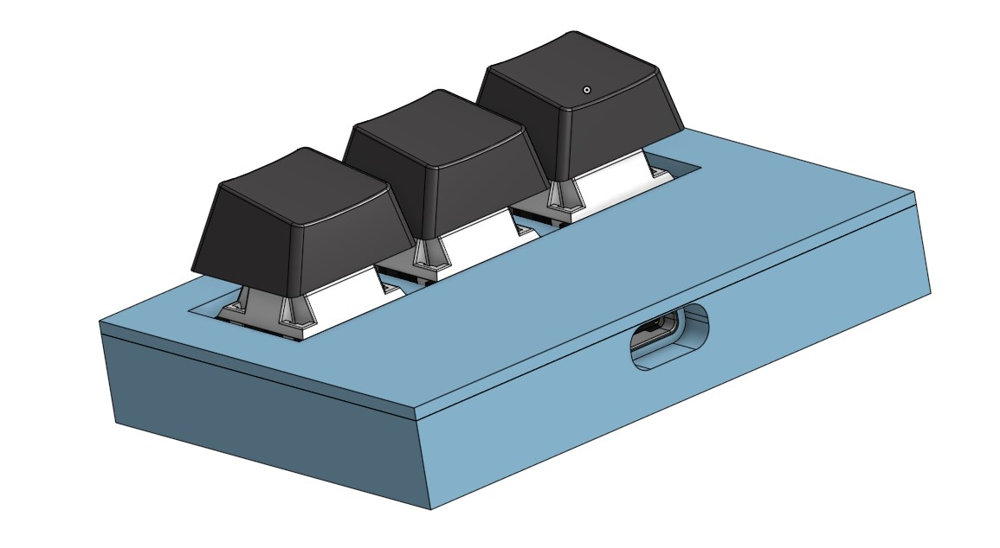
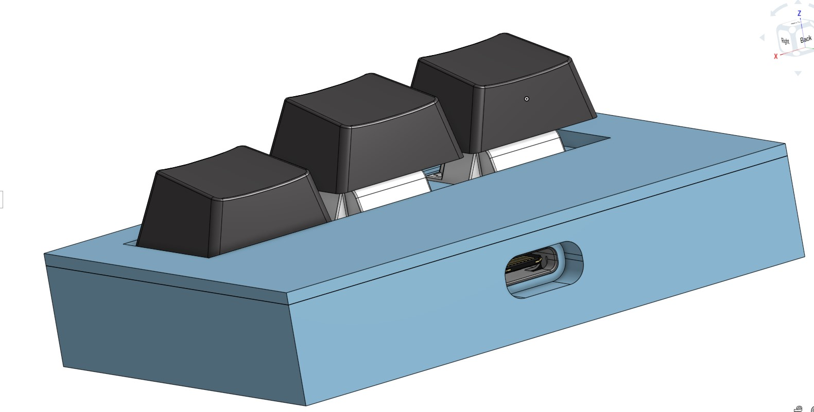

Total time -- 7 hours

6/2/2025 made the 1st prototype pcb for the keypad -- 3 hours\
    3 key keypad, 2 LEDs, using the Seeed studio XIAO RP 2040 DIP as the primary chip\
    \

6/3/25 changed the pcb to use an arduino micro -- 10 minutes\
6/3/25 changed the pcb back to using the XIAO RP 2040 DIP -- 0.5 minutes (pressed ctrl + z alot)\
6/3/25 moved all components except for some pcb routes to the front of the pcb -- 5 minutes\
    \
6/3/25 began modeling the case, fit the case to the PCB and keys -- 1 hour\
    some stuff isn't quite accurate, and just a box right now\
    \
6/4/25 started on the software for the keypad -- 30 minutes\
6/4/25 continued working on the model -- 30 minutes\
    added some depressions for the keys\
    
6/6/25 did some more stuff with the model, namely mated everything in onshape so that i could test the fit of things and whether or not the keys had enough space to move -- 2 hours \
    probably wasn't neccesary . . .
    
6/6/25 made the whole thing thicker so the switches stick out less -- 25 minutes \
    
6/7/25 decided to make a case that looked like maomao from apothecary diaries -- 1.3 hour \
    \
    also needed a differently shaped pcb\
    

