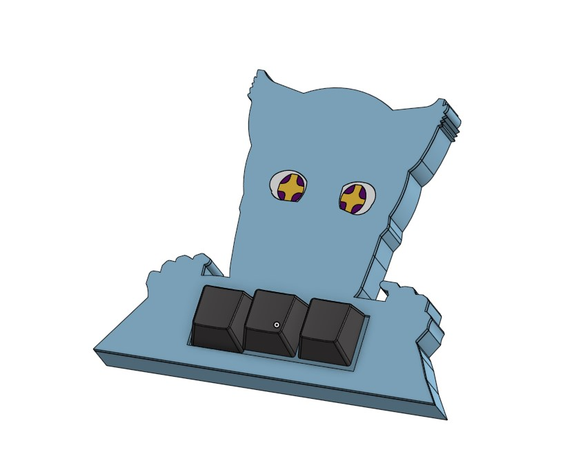
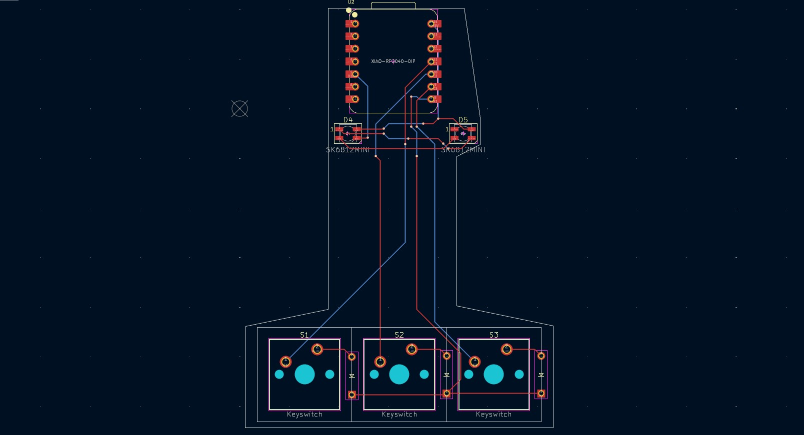

# Keypad
Our project is a keypad for the rhythm game osu! that has leds that get brighter the faster you tap, these leds would be behind eyes or a blush or something so whatever we end up plastering on our keypad will have its eyes get brighter / blush harder when you tap faster. 
We made the project because we got bored over the summer and I also happen to want a keypad to play osu because my current keyboard is quite low quality.

In the end I decided to have maomao from apothecary diaries as my keypad and the eyes light up when u tap faster\
\
the pcb:
\

| Item No. | Quantity | Part No.                  | Desc                           | Link                                                                                                                                                                                                         | Price |                                                                                                                        |
|----------|----------|---------------------------|--------------------------------|--------------------------------------------------------------------------------------------------------------------------------------------------------------------------------------------------------------|-------|------------------------------------------------------------------------------------------------------------------------|
| 1        | 1        | case/case.step            | 3d print this                  |                                                                                                                                                                                                              | 20    |                                                                                                                        |
| 2        | 1        | case/face_plate.step      | 3d print this                  |                                                                                                                                                                                                              |       |                                                                                                                        |
| 3        | 1        | case/eye_white_left.step  | 3d print this                  | Amazon.com: 15 Bright Colors 1.75mm 3D Pen PLA Filament Refill, Each Color 10feet, Total 150 Feet 3D Pen/3D Printer PLA Sample Pack, Compatible with MYNT3D / SCRIB3D Printing Pen : Industrial & Scientific | $8    | a 1.75mm 3d pen refill should be enough to print all pieces (printed 1-2 layers high so light may still shine through) |
| 4        | 1        | case/eye_white_right.step | 3d print this                  |                                                                                                                                                                                                              |       |                                                                                                                        |
| 5        | 1        | case/star_left.step       | 3d print this                  |                                                                                                                                                                                                              |       |                                                                                                                        |
| 6        | 1        | case/star_right.step      | 3d print this                  |                                                                                                                                                                                                              |       |                                                                                                                        |
| 7        | 1        | case/iris_1.step          | 3d print this                  |                                                                                                                                                                                                              |       |                                                                                                                        |
| 8        | 1        | case/iris_2.step          | 3d print this                  |                                                                                                                                                                                                              |       |                                                                                                                        |
| 9        | 1        | case/iris_3.step          | 3d print this                  |                                                                                                                                                                                                              |       |                                                                                                                        |
| 10       | 1        | case/iris_4.step          | 3d print this                  |                                                                                                                                                                                                              |       |                                                                                                                        |
| 11       | 1        | case/iris_5.step          | 3d print this                  |                                                                                                                                                                                                              |       |                                                                                                                        |
| 12       | 1        | case/iris_6.step          | 3d print this                  |                                                                                                                                                                                                              |       |                                                                                                                        |
| 13       | 1        | case/iris_7.step          | 3d print this                  |                                                                                                                                                                                                              |       |                                                                                                                        |
| 14       | 1        | case/iris_8.step          | 3d print this                  |                                                                                                                                                                                                              |       |                                                                                                                        |
| 15       | 3        | Cherry MX reds            | switches                       |                                                                                                                                                                                                              | 1.2   |                                                                                                                        |
| 16       | 3        |                           | some sort of cherry mx keycaps |                                                                                                                                                                                                              | 1.2   |                                                                                                                        |
| 17       | 1        | XIAO RP 2040 DIM          | Primary chip                   | Seeed Studio XIAO RP2040, Mini Arduino Dev Board with RP2040 and MicroPython Support                                                                                                                         | $3.90 |                                                                                                                        |
| 18       | 3        |                           | diode of some sort             |                                                                                                                                                                                                              | 2     |                                                                                                                        |
| 19       | 2        | SK6812 Mini               | RGB LEDs                       |                                                                                                                                                                                                              | 3     |                                                                                                                        |
| 20       | 1        | ./pcb                     | PCB                            |                                                                                                                                                                                                              | $3    |                                                                                                                        |
|          |          |                           |                                |                                                                                                                                                                                                              | 42.3  |                                                                                                                        |
